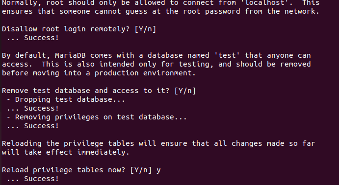

# Avtivitat 2
## Com instal·lar Owncloud

### Instal·lació Apache:
El primer pas serà instal·lar Apache.
Instal·larem apache server amb aquesta comanda: sudo apt install apache2

I tot segit desactivarem el llistat de directoris del servidor amb aquesta comanda: 
sudo sed -i "s/Options Indexes FollowSymLinks/Options FollowSymLinks/" /etc/apache2/apache2.conf

### Instal·lació MariaDB:

Seguirem amb la instal·lació de MariaDB.
Ho instal·larem amb aquesta comanda: sudo apt-get install mariadb-server mariadb-client -y

I configurarem la instal:lació:

I farem els següents canvis:

- Deshabilitar usuaris anònims.
- Deshabiliteu accés remot com a root.
- Eliminar les bases de dades de testeig i accedir-hi.
- Actualitzar les taules de privilegis.

I per últim reiniciarem el servidor MariaBD

### Crearem la base de dades de owncloud:

Entrarem a MariaBD:

Crearem al base de dades:

Crearem l'usuari i contraseña:

Li donem acces a l'usuari creat a la base de dades:

### Instal·lar PHP i els seus mòduls necessàris:

Actulitzem els paquets amb el repositori:

Instal·lem PHP i els mòduls necessaris.

Després editarem el fitcher php.ini i canviarem alguns valors: 
file_uploads = On allow_url_fopen = On memory_limit = 256M upload_max_filesize = 100M display_errors = Off date.timezone = Europe/Madrid

Comanda per accedir: ***sudo nano /etc/php/7.1/apache2/php.ini***

### Instal·larem Owncloud: 

Descargarem la última versió i canviarem el propietari i els directoris d'owncloud.:

### Configurar Apache:

Entrarema la configuració i posarem aquest text:

# Activitat 3

#### Canviar nom i correu:

